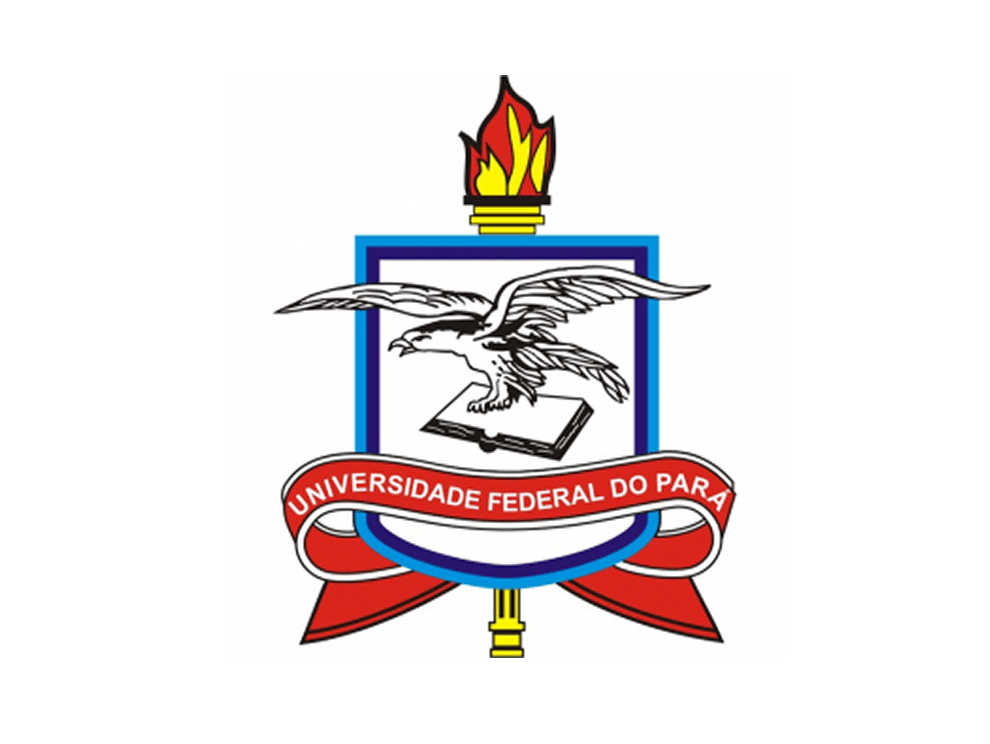

# 🌞 Escola de Verão IWASA'I
Genômica e Bioinformática - Primeira Edição
Bem-vindos ao repositório oficial da Escola de Verão IWASA'I!
Nesta primeira edição, temos como tema central:

## "Introdução à Genômica e Bioinformática: Da Teoria à Prática com Genomas Microbianos"

A Escola de Verão IWASA'I é uma iniciativa do projeto IWASA'I, que visa democratizar o acesso à formação científica em áreas estratégicas como genômica, bioinformática e ciência de dados biológicos, especialmente entre estudantes e jovens pesquisadores da região Norte do Brasil.

### 🎯 Objetivos da Primeira Escola
- Introduzir os conceitos fundamentais da genômica moderna;

- Capacitar os participantes na montagem e anotação de genomas bacterianos;

- Apresentar ferramentas computacionais amplamente utilizadas em bioinformática;

- Promover a integração entre teoria e prática através de minicursos e oficinas;

- Estimular a formação de redes colaborativas em ciência genômica regional.

### 📚 Conteúdo Programático
A primeira edição conta com atividades teóricas e práticas nos seguintes tópicos:

- Biologia Molecular e Sequenciamento de DNA

- Qualidade e limpeza de dados de sequenciamento

- Montagem de genomas (SPAdes, Unicycler)

- Avaliação da montagem (QUAST, BUSCO)

- Anotação genômica (Prokka, Bakta, DFAST)

- Identificação de RNAs e elementos genéticos móveis

- Visualização e interpretação de dados genômicos

### 🔬 Público-Alvo
Estudantes de graduação e pós-graduação, pesquisadores e profissionais interessados em biotecnologia, bioinformática, microbiologia e áreas afins.

### 🤝 Apoio e Organização

   

## 📞 Contato

Fique à vontade para entrar em contato conosco pelos canais abaixo:

- 📧 **E-mail**: [engbiopct@gmail.com](mailto:engbiopct@gmail.com)
- 📸 **Instagram**: [@engbiopct](https://www.instagram.com/engbiopct)
- 💼 **LinkedIn**: [Laboratório de Engenharia Biológica - EngBIO](https://www.linkedin.com/in/engbiopct/)

---

Siga-nos para acompanhar novidades sobre nossos projetos, publicações e oportunidades!

