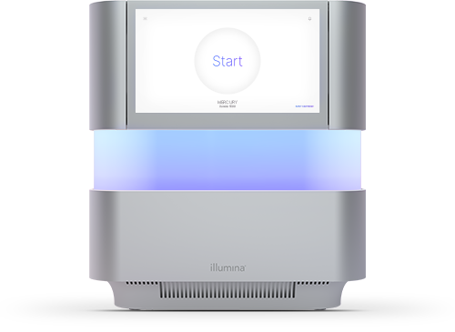
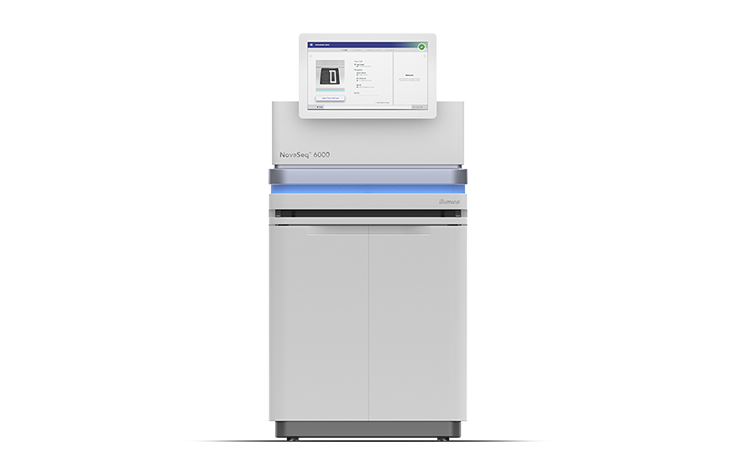
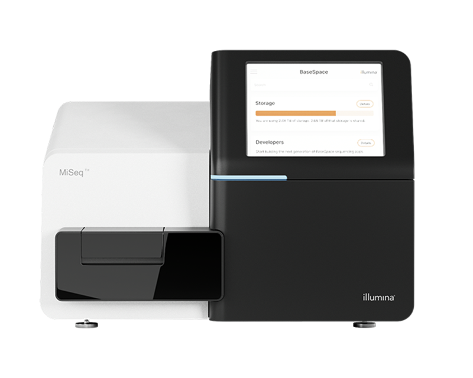

# Origem dos dados em bioinformática

## 1. Do sequenciamento ao dado digital

- Extração do material genético: inicia-se com a extração de DNA ou RNA da amostra biológica.

- Preparação da biblioteca (Library Prep): fragmentação, adição de adaptadores e quantificação (ex: Qubit, qPCR).

- Amplificação e/ou clonagem: em algumas plataformas, ocorre amplificação por PCR ou bridge amplification.

- Sequenciamento: uso de plataformas que convertem moléculas biológicas em leituras digitais (reads).

- Formato de saída: arquivos como FASTQ (sequências + qualidade), SAM/BAM

## 2. Principais plataformas de sequenciamento
- Illumina (Sequencing by Synthesis – SBS)

- Amplamente utilizada, com alta acurácia (> 99 %) e alto throughput. Modalidades incluem NovaSeq, MiSeq, NextSeq 550

- Leitura curta (curtread) de até ~300 bp por extremidade. Ideal para RNA‑seq, exoma, re‑seq, estudos populacionais

Exemplos:

  
