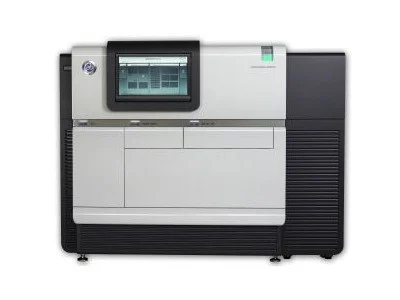
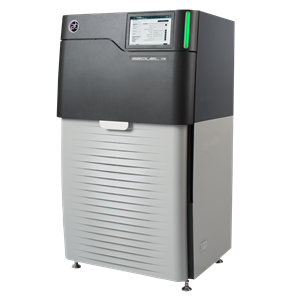
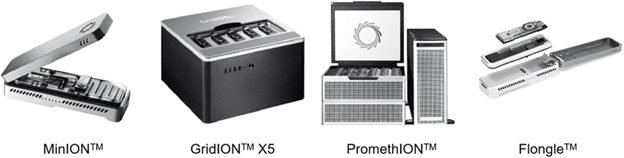
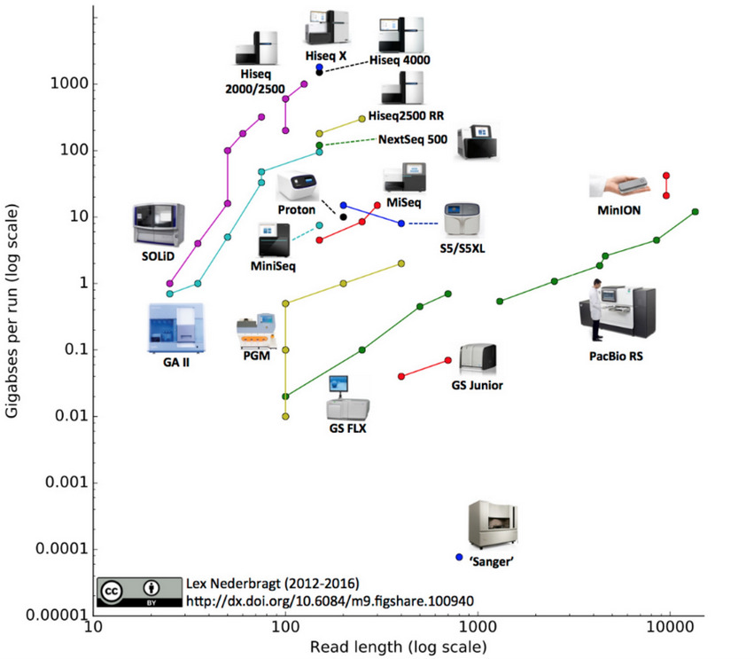

# Origem dos dados utilizados na Bioinformática

## 1. Do sequenciamento ao dado digital

- Extração do material genético: inicia-se com a extração de DNA ou RNA da amostra biológica.

- Preparação da biblioteca: fragmentação, adição de adaptadores e quantificação (ex: Qubit, qPCR).

- Amplificação e/ou clonagem: em algumas plataformas, ocorre amplificação por PCR ou bridge amplification.

- Sequenciamento: uso de plataformas que convertem moléculas biológicas em leituras digitais (reads).

- Formato de saída: arquivos como FASTQ (sequências + qualidade), SAM/BAM

## 2. Principais plataformas de sequenciamento
### Illumina (Sequencing by Synthesis – SBS)

- Amplamente utilizada, com alta acurácia (> 99 %) e alto throughput. Modalidades incluem NovaSeq, MiSeq, NextSeq 550

- Leitura curta (short reads) de até ~300 bp por extremidade. Ideal para RNA‑seq, exoma, re‑seq, estudos populacionais

Exemplos:

  

### Pacific Biosciences (PacBio – SMRT e HiFi reads)
- Sequenciamento de molécula única em tempo real, com leituras longas (até dezenas de kb) e alta acurácia na versão HiFi (~99,9 %)
- Excelente para montagem de novo de genomas, detecção de variantes estruturais e epigenoma

Exemplos:

  

### Oxford Nanopore Technologies (ONT – nanopore sequencing)
- Detecta alterações na corrente elétrica à medida que a molécula de DNA/RNA passa por um nanoporo. Permite leituras ultralongas (muitas centenas de kb a Mb) e sequenciamento em tempo real.

Exemplos:

 

 

### Plataformas

## 3. Formato do Dado

