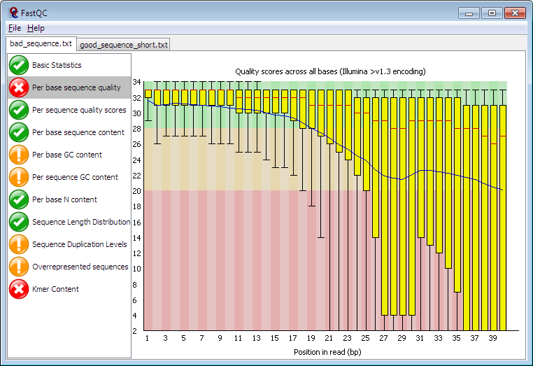

# Módulo 1: Preparação do Ambiente e Qualidade dos Dados Brutos
Este módulo foca na configuração do ambiente de trabalho e na avaliação da qualidade das leituras (reads) de sequenciamento.

## 1.1 Configuração Inicial
Objetivo: Preparar o ambiente Linux para as análises.

Ferramentas: apt, wget, git

Comandos:

```
sudo apt update
sudo apt upgrade -y
sudo apt install -y build-essential wget git unzip screen default-jre
```

Descrição: Atualiza o sistema, instala compiladores C/C++, `wget` para downloads, `git` para clonar repositórios, `unzip` para descompactar arquivos, `screen` para sessões persistentes no terminal e `Java` (JRE) para algumas ferramentas.

## 1.2 Download de Dados de Sequenciamento
Objetivo: Obter reads brutos de sequenciamento (FASTQ) de um organismo procarioto.
Ferramentas: wget ou fastq-dump (do SRA Toolkit)
Comandos (exemplo com wget para um arquivo público ou SRA Toolkit):

### Exemplo : Download direto de um link (substitua pelo seu link FASTQ)

Objetivo: Obter os reads brutos de sequenciamento (geralmente em formato FASTQ) que servirão como entrada para a montagem do genoma.

Ferramentas: wget ou fastq-dump (parte do SRA Toolkit)
Comandos (exemplo com fastq-dump para um SRA Accession):

```
# Instalar SRA Toolkit (verifique a versão mais recente no site do NCBI)
wget https://ftp.ncbi.nlm.nih.gov/sra/sdk/current/sratoolkit.current-ubuntu64.tar.gz
tar -xzf sratoolkit.current-ubuntu64.tar.gz
chmod -R 777 sratoolkit.3.2.1-ubuntu64 #Permissão total na pasta
export PATH=$PATH:/home/allan/Downloads/sratoolkit.3.2.1-ubuntu64/bin # Adiciona ao PATH 
# Criar diretório para os dados brutos
mkdir raw_data
cd raw_data

# Exemplo: Baixar dados de um SRA Accession (e.g., SRR10461876 para E. coli)
fastq-dump --split-files SRR10461876
# Isso gerará SRR10461876_1.fastq e SRR10461876_2.fastq (para reads pareados)
cd .. # Voltar ao diretório principal do curso
```
### Descrição Detalhada:

- SRA Toolkit: Este conjunto de ferramentas do NCBI (National Center for Biotechnology Information) é essencial para acessar dados de sequenciamento depositados no Sequence Read Archive (SRA), um dos maiores repositórios de dados genômicos.
  
- wget https://ftp.ncbi.nlm.nih.gov/sra/sdk/current/sratoolkit.current-ubuntu64.tar.gz: Baixa o arquivo compactado do SRA Toolkit para sistemas Ubuntu de 64 bits. É importante verificar o link mais recente no site do NCBI, pois as versões são atualizadas.

- tar -xzf sratoolkit.current-ubuntu64.tar.gz: Descompacta o arquivo baixado. O x extrai, z descompacta com gzip, e f especifica o arquivo.

- export PATH=$PATH:$(pwd)/sratoolkit.current-ubuntu64/bin: Adiciona o diretório bin do SRA Toolkit à sua variável de ambiente PATH. Isso permite que você execute comandos como fastq-dump de qualquer lugar no terminal, sem precisar especificar o caminho completo para o executável. Esta adição é temporária para a sessão atual do terminal; para torná-la permanente, você precisaria adicioná-la ao seu arquivo .bashrc ou .profile.

- mkdir raw_data: Cria um diretório chamado raw_data para organizar os arquivos FASTQ brutos. Manter seus dados organizados é uma prática fundamental em bioinformática.

- cd raw_data: Entra no diretório raw_data.

- fastq-dump --split-files SRR10461876: Este é o comando principal para baixar os reads.

- fastq-dump: O programa do SRA Toolkit que converte dados do formato SRA para FASTQ.

- --split-files: Crucial para dados paired-end. Se os reads forem pareados (como é comum em sequenciamento Illumina), esta opção garante que os reads do forward (_1.fastq) e do reverse (_2.fastq) sejam salvos em arquivos separados. Isso é necessário para a maioria das ferramentas de montagem que esperam essa separação.

- SRR10461876: É o accession number (número de acesso) de um conjunto de dados no SRA. Você substituiria isso pelo accession do seu próprio conjunto de dados.

### 1.3 Avaliação da Qualidade dos Reads
Objetivo: Avaliar a qualidade dos reads brutos para identificar problemas como adaptadores de sequenciamento, bases de baixa qualidade, viés de GC e contaminação. Esta etapa é crítica para garantir que apenas dados de alta qualidade sejam usados na montagem.

Ferramentas: FastQC

Comandos:

```
sudo apt install -y fastqc
mkdir qc_raw
fastqc raw_data/*.fastq -o qc_raw/
```

Forma de Execução: Os relatórios HTML gerados em qc_raw/ devem ser abertos em um navegador web para inspeção visual. Você pode transferi-los para sua máquina local usando scp ou sftp se estiver em um servidor remoto, ou abri-los diretamente se estiver em uma máquina virtual com ambiente gráfico.

### Descrição Detalhada:

- sudo apt install -y fastqc: Instala a ferramenta FastQC.

- mkdir qc_raw: Cria um diretório dedicado para armazenar os relatórios de qualidade dos reads brutos.

- fastqc raw_data/*.fastq -o qc_raw/: Executa o FastQC em todos os arquivos .fastq dentro do diretório raw_data e direciona a saída (relatórios HTML e arquivos ZIP contendo os dados brutos do relatório) para o diretório qc_raw/.

### O que é Qualidade (Escala Phred): A qualidade de uma base em um read de sequenciamento é geralmente expressa usando a escala Phred. Um valor Phred (Q) é uma medida logarítmica da probabilidade de erro de uma base.

- `Q=−10`
- log_10(P), onde P é a probabilidade de a base estar incorreta.

- Um Q20 significa que a probabilidade de erro é de 1 em 100 (P=0.01), ou 99% de acurácia.

- Um Q30 significa que a probabilidade de erro é de 1 em 1000 (P=0.001), ou 99.9% de acurácia.

- Em geral, reads com qualidade Phred abaixo de Q20 (especialmente nas extremidades) são considerados de baixa qualidade e devem ser removidos ou trimados.

| Qualidade Phred (Q) | Probabilidade de Erro (P) | Precisão da Base (%) |
|---------------------|---------------------------|-----------------------|
| 10                  | 1 em 10                   | 90%                  |
| 20                  | 1 em 100                  | 99%                  |
| 30                  | 1 em 1.000                | 99,9%                |
| 40                  | 1 em 10.000               | 99,99%               |
| 50                  | 1 em 100.000              | 99,999%              |
| 60                  | 1 em 1.000.000            | 99,9999%             |


## Avaliação de Qualidade - FASTQC

Abaixo está uma imagem de exemplo da avaliação de qualidade (Per Base Sequence Quality) gerada pelo FastQC:




### Interpretação dos Gráficos do FastQC:

Per Base Sequence Quality:

- Mostra a qualidade média de cada posição de base ao longo dos reads.

- Padrão ideal: A caixa de bigodes deve estar acima de Q30 (linha verde) em todas as posições, com pouca variação.

- Problemas: Quedas na qualidade nas extremidades 3' dos reads são comuns e esperadas. Qualidade baixa no início do read ou flutuações significativas indicam problemas no sequenciamento.

Per Sequence Quality Scores:

- Mostra a distribuição da qualidade média para cada read.

- Padrão ideal: Um pico alto em valores de alta qualidade (Q30+).

- Problemas: Um pico em valores de baixa qualidade indica muitos reads problemáticos.

Per Base Sequence Content:

- Mostra a porcentagem de cada base (A, T, C, G) em cada posição do read.

- Padrão ideal: Linhas planas e paralelas, indicando uma distribuição aleatória de bases.

- Problemas: Desvios significativos, especialmente no início dos reads, podem indicar contaminação por adaptadores ou problemas de sequenciamento.

Per Sequence GC Content:

- Mostra a distribuição do conteúdo de GC para todos os reads.

- Padrão ideal: Uma curva gaussiana (normal) centrada no conteúdo de GC esperado para o organismo.

- Problemas: Múltiplos picos podem indicar contaminação por outras espécies ou DNA de hospedeiro.

Sequence Length Distribution:

- Mostra a distribuição dos comprimentos dos reads.

- Padrão ideal: Um único pico no comprimento esperado dos reads (e.g., 150 bp para Illumina).

- Problemas: Múltiplos picos ou uma distribuição ampla podem indicar degradação da amostra ou problemas na biblioteca.

Adapter Content:

- Detecta a presença de sequências de adaptadores de sequenciamento.

- Padrão ideal: Linhas planas na parte inferior do gráfico (sem adaptadores detectados).

- Problemas: Curvas ascendentes indicam que adaptadores estão presentes e precisam ser removidos.

### 1.4 Filtragem e Trimagem dos Reads
Objetivo: Remover adaptadores de sequenciamento, bases de baixa qualidade e reads curtos que podem prejudicar a montagem do genoma. Esta etapa é crucial para melhorar a acurácia da montagem.

Ferramentas: Trimmomatic

Comandos:

```
# Download do Trimmomatic (verifique a versão mais recente em http://www.usadellab.org/cms/index.php?page=trimmomatic)
wget http://www.usadellab.org/cms/uploads/supplementary/Trimmomatic/Trimmomatic-0.39.zip
unzip Trimmomatic-0.39.zip
# Acessar o diretório do Trimmomatic para encontrar os arquivos de adaptadores
TRIMMOMATIC_DIR=$(pwd)/Trimmomatic-0.39

# Exemplo de trimagem para reads pareados (ajuste os parâmetros conforme necessário)
mkdir trimmed_reads
java -jar ${TRIMMOMATIC_DIR}/trimmomatic-0.39.jar PE \
raw_data/SRR10461876_1.fastq raw_data/SRR10461876_2.fastq \
trimmed_reads/SRR10461876_1_paired.fastq trimmed_reads/SRR10461876_1_unpaired.fastq \
trimmed_reads/SRR10461876_2_paired.fastq trimmed_reads/SRR10461876_2_unpaired.fastq \
ILLUMINACLIP:${TRIMMOMATIC_DIR}/adapters/TruSeq3-PE.fa:2:30:10 \
LEADING:3 TRAILING:3 SLIDINGWINDOW:4:15 MINLEN:36
```

### Descrição Detalhada:

O Trimmomatic é uma ferramenta baseada em Java para trimagem de reads de sequenciamento de alto rendimento.

- wget ... Trimmomatic-0.39.zip: Baixa o arquivo compactado do Trimmomatic.

- unzip Trimmomatic-0.39.zip: Descompacta a ferramenta.

- TRIMMOMATIC_DIR=$(pwd)/Trimmomatic-0.39: Define uma variável de ambiente para o diretório do Trimmomatic, facilitando a referência aos arquivos de adaptadores.

- mkdir trimmed_reads: Cria um diretório para armazenar os reads de alta qualidade após a trimagem.

- java -jar ${TRIMMOMATIC_DIR}/trimmomatic-0.39.jar PE: Executa o Trimmomatic.

- PE: Indica que estamos processando reads pareados (Paired-End). Para reads single-end, usaria SE.

- raw_data/SRR10461876_1.fastq raw_data/SRR10461876_2.fastq: São os arquivos de entrada para os reads forward e reverse, respectivamente.

- trimmed_reads/SRR10461876_1_paired.fastq trimmed_reads/SRR10461876_1_unpaired.fastq \ trimmed_reads/SRR10461876_2_paired.fastq trimmed_reads/SRR10461876_2_unpaired.fastq: São os quatro arquivos de saída. O Trimmomatic separa os reads em:

- _paired.fastq: Reads que ainda têm seu par após a trimagem. Estes são os mais importantes para a montagem de novo.

- _unpaired.fastq: Reads que perderam seu par (porque o par foi descartado ou trimado excessivamente). Podem ser usados em algumas montagens, mas geralmente são menos informativos.

Parâmetros de Trimagem (Explicados):

- ILLUMINACLIP:${TRIMMOMATIC_DIR}/adapters/TruSeq3-PE.fa:2:30:10: Esta operação remove sequências de adaptadores Illumina.

- TruSeq3-PE.fa: É o arquivo FASTA contendo as sequências dos adaptadores Illumina. O Trimmomatic vem com vários arquivos de adaptadores pré-definidos.

- 2: Máximo de mismatches permitidos ao alinhar o adaptador.

- 30: Palindromic clip threshold. Se a sequência do read e seu par se sobrepuserem com o adaptador, esta é a pontuação mínima para remover o adaptador.

- 10: Simple clip threshold. Pontuação mínima para remover o adaptador de um read individual.

- LEADING:3: Remove bases do início (leading) de um read se a qualidade Phred for menor que 3. Isso é útil para cortar bases de baixa qualidade que podem aparecer no começo da leitura.

- TRAILING:3: Remove bases do final (trailing) de um read se a qualidade Phred for menor que 3. Semelhante ao LEADING, mas atua no final, onde a qualidade geralmente decai.

- SLIDINGWINDOW:4:15: Implementa uma estratégia de trimagem de janela deslizante.

- 4: Tamanho da janela (em bases).

- 15: Qualidade mínima média dentro da janela.

O Trimmomatic desliza uma janela de 4 bases ao longo do read. Se a qualidade média das bases dentro dessa janela cair abaixo de 15, o read é cortado a partir da primeira base da janela. Isso ajuda a remover seções de baixa qualidade dentro do read.

- MINLEN:36: Descarta completamente qualquer read que, após todas as operações de trimagem, tenha um comprimento inferior a 36 bases. Reads muito curtos são difíceis de alinhar ou montar de forma confiável.

### 1.5 Reavaliação da Qualidade dos Reads Trimados
Objetivo: Confirmar a melhoria da qualidade dos reads após a trimagem e filtragem, garantindo que os dados estão prontos para a montagem. Esta etapa é um controle de qualidade final antes de prosseguir.

Ferramentas: FastQC

Comandos:
```
mkdir qc_trimmed
fastqc trimmed_reads/*.fastq -o qc_trimmed/
```
