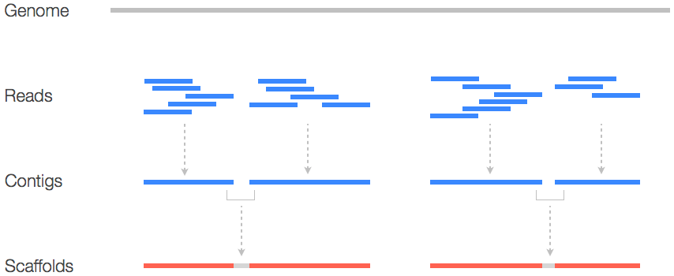
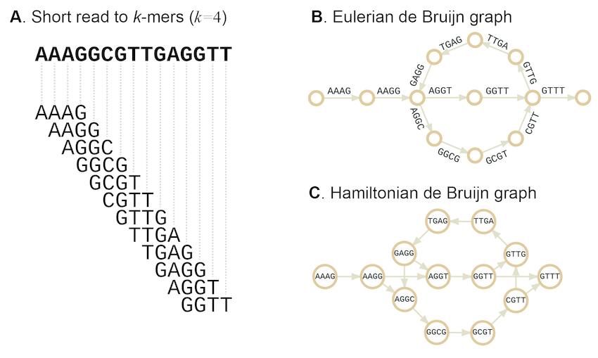

# Módulo 2: Montagem do Genoma
Este módulo aborda a reconstrução do genoma a partir dos reads curtos e a avaliação da qualidade da montagem.

# Objetivo do processo de Montagem juntamente com etapas




### 2.1 Montagem de Genomas (De Novo Assembly)
Objetivo: Juntar os reads filtrados e de alta qualidade para formar contigs (sequências contíguas) e, idealmente, scaffolds (contigs ordenados e orientados por informações de pareamento). A montagem de novo significa que não usamos um genoma de referência pré-existente.

Ferramentas: SPAdes (para genomas bacterianos e arqueais)

Comandos:
```
sudo apt install -y spades
mkdir assembly
spades.py --careful -o assembly/SRR10461876_assembly \
-1 trimmed_reads/SRR10461876_1_paired.fastq \
-2 trimmed_reads/SRR10461876_2_paired.fastq
```

### Descrição Detalhada:

- sudo apt install -y spades: Instala o montador de genomas SPAdes. O SPAdes (St. Petersburg Genome Assembler) é um dos montadores mais populares e robustos para genomas de procariotos, capaz de lidar com dados de Illumina, Ion Torrent e até mesmo reads híbridos (curtos e longos).

- mkdir assembly: Cria um diretório para armazenar os resultados da montagem.

- spades.py --careful -o assembly/SRR10461876_assembly: Executa o script principal do SPAdes.

- --careful: Esta opção ativa um modo de montagem mais rigoroso. Ele realiza um passo adicional de correção de erros e tenta reduzir o número de erros de montagem e quimeras (contigs que combinam sequências de regiões não adjacentes do genoma), o que é especialmente útil para dados com cobertura irregular ou contaminação. Embora possa aumentar o tempo de execução, geralmente resulta em uma montagem de maior qualidade.

- -o assembly/SRR10461876_assembly: Define o diretório de saída onde todos os arquivos gerados pelo SPAdes serão armazenados.

- -1 trimmed_reads/SRR10461876_1_paired.fastq: Especifica o arquivo de reads do forward pareados, que foram previamente trimados.

- -2 trimmed_reads/SRR10461876_2_paired.fastq: Especifica o arquivo de reads do reverse pareados, também trimados.

Saídas do SPAdes: O diretório de saída (assembly/SRR10461876_assembly/) conterá vários arquivos, sendo os mais importantes:

- contigs.fasta: Este é o arquivo principal, contendo todas as sequências contíguas (contigs) montadas. Para procariotos, o objetivo é ter o menor número possível de contigs, idealmente um único cromossomo circular.

- scaffolds.fasta: Se o SPAdes conseguir usar as informações de pareamento para ordenar e orientar contigs em fragmentos maiores, eles serão colocados neste arquivo.

- assembly_graph.gfa: O grafo de montagem no formato GFA (Graph Fragment Assembly). Pode ser visualizado com ferramentas como Bandage.

- params.txt: Arquivo com os parâmetros usados na montagem.

- log: Arquivo de log detalhado da execução do SPAdes.


Conceito de K-mers: Montadores de novo como o SPAdes funcionam construindo um grafo de De Bruijn. Eles quebram os reads em sub-sequências de comprimento fixo chamadas "k-mers". As sobreposições entre esses k-mers são usadas para construir o grafo, onde os nós são k-mers e as arestas representam sobreposições. Caminhos através do grafo representam as sequências do genoma. O SPAdes testa múltiplos tamanhos de k-mers automaticamente para encontrar a melhor montagem.



### 2.2 Avaliação da Qualidade da Montagem
Objetivo: Avaliar métricas importantes da montagem para determinar sua completude, contiguidade e acurácia. Esta etapa é crucial para entender a qualidade do genoma reconstruído.

Ferramentas: QUAST (Quality Assessment Tool for Genome Assemblies) : https://github.com/ablab/quast

Comandos:

```
sudo apt install -y quast
mkdir quast_report
quast.py assembly/SRR10461876_assembly/contigs.fasta -o quast_report/
```

Forma de Execução: Abrir o relatório HTML gerado em quast_report/ em um navegador web para uma análise detalhada.

### Descrição Detalhada:

- sudo apt install -y quast: Instala a ferramenta QUAST.

- mkdir quast_report: Cria um diretório para armazenar os relatórios do QUAST.

- quast.py assembly/SRR10461876_assembly/contigs.fasta -o quast_report/: Executa o QUAST no arquivo contigs.fasta gerado pelo SPAdes.

Você pode opcionalmente fornecer um genoma de referência com -r reference.fasta para obter métricas adicionais, como alinhamento e cobertura em relação a uma referência conhecida.

Métricas de Qualidade da Montagem (Explicadas): O QUAST gera um relatório abrangente com várias estatísticas, sendo as mais importantes:

- Número de contigs: O total de sequências contíguas geradas. Para um genoma procarioto, o ideal é ter um número baixo (próximo de 1 para um cromossomo circular, mais alguns para plasmídeos). Um número muito alto pode indicar uma montagem fragmentada.

- Tamanho total do genoma montado (Total length): A soma dos comprimentos de todos os contigs. Deve ser próximo ao tamanho esperado do genoma do organismo (e.g., 4-5 Mbp para muitas bactérias). Desvios significativos podem indicar contaminação ou montagem incompleta.

- N50: Uma métrica de contiguidade. É o comprimento do contig tal que 50% do comprimento total do genoma montado está contido em contigs de tamanho igual ou maior que N50. Um N50 maior indica uma montagem mais contígua (menos fragmentada). Por exemplo, se o N50 for 1 Mbp, significa que metade do genoma está em contigs de 1 Mbp ou maiores.

- NGA50: Similar ao N50, mas considera a montagem em relação a um genoma de referência (se fornecido).

- Maior contig (Largest contig): O comprimento do contig mais longo na montagem.

- Conteúdo GC (%GC): A porcentagem de bases Guanina e Citosina no genoma montado. Deve ser consistente com o conteúdo GC esperado para a espécie.

- Número de Ns (Número de bases indeterminadas): O total de bases "N" (qualquer base) nos contigs. Um número alto de Ns indica lacunas na montagem.

- Misassemblies (se referência fornecida): Pontos onde a montagem difere significativamente do genoma de referência, indicando erros estruturais.

- Gráficos do QUAST: O relatório HTML inclui gráficos como a distribuição de comprimentos de contigs, que visualiza a contiguidade da montagem.


