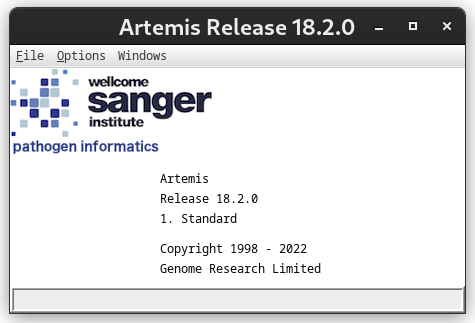
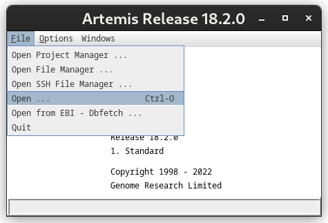
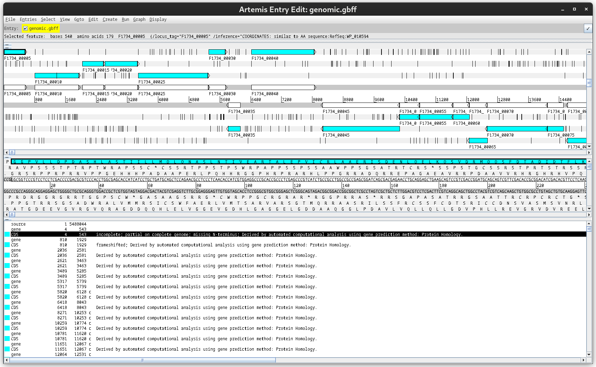

Neste módulo, você aprenderá:

- O que é um genome browser e por que ele é importante na montagem e anotação genômica.
- As principais funcionalidades do Artemis, uma ferramenta gráfica para visualização e anotação de genomas.
- Como utilizar o Artemis com dados reais (montagem + anotação).
- Passo a passo completo com imagens descritivas para facilitar o uso prático.

# 1. O que são Genome Browsers?

**Genome browsers** são ferramentas que permitem visualizar, explorar e interpretar genomas de forma gráfica e interativa. Eles possibilitam navegar por sequências genômicas, verificar anotações, explorar regiões codificantes e não codificantes, além de avaliar alinhamentos e evidências experimentais.

### Exemplos de softwares populares:

- [UCSC Genome Browser](https://genome.ucsc.edu/)
- [Ensembl Genome Browser](https://www.ensembl.org/index.html)
- [GBrowse](http://gmod.org/wiki/GBrowse)
- [IGV - Integrative Genomics Viewer](https://software.broadinstitute.org/software/igv/)
- **Artemis** (local, offline – foco deste módulo)


## 🧬 2. Artemis: Visualizador e Anotador Genômico (Curadoria) 🧬

**Artemis** é uma aplicação gráfica desenvolvida pelo [Wellcome Sanger Institute](https://www.sanger.ac.uk/tool/artemis/), ideal para visualizar sequências genômicas e realizar anotações em arquivos de montagem e genbank (GBK).

### Principais recursos:

- Visualização interativa de sequência e ORFs.
- Importação de arquivos `.fasta`, `.gbk`, `.gff`, `.bam` e `.sam`.
- Anotação manual e automática.
- Ferramentas de busca, tradução, comparação e exportação.

## 🛠️ 3. Fazendo a instalação do Artemis

### Pré-requisitos:

- Java 11 ou superior instalado

### Download:

```bash
wget https://sanger-pathogens.github.io/Artemis/artemis.jar
````

### Execução:

```bash
java -jar artemis.jar

Você também pode executar ele diretamente no script `Entre na Pasta dele e execute a linha abaixo, Ps: É preciso de permissão ou execute com o bash`

./art

```

---

## 🧪 4. Exemplo prático: Visualizando um genoma procarioto

Neste exemplo, vamos utilizar a montagem e anotação de uma *Escherichia coli*, com os arquivos:

* `ecoli.fna` – sequência genômica
* `ecoli.gff` – anotações estruturais
* `ecoli.gbk` – arquivo completo com anotações (opcional)

---

### 📁 Etapa 1: Abrindo o arquivo GenBank no Artemis

1. Execute o Artemis:

```bash
java -jar artemis.jar
```

2. Vá em **File > Open**.
3. Selecione o arquivo `ecoli.gbk`.

** **

Janela Principal

**

Janela do Artemis com a sequência aberta, mostrando as faixas genômicas e ORFs coloridas.

---

### 🔍 Etapa 2: Navegação básica

* Use o **mouse** ou as setas para se mover pela sequência.
* Clique duplo sobre um gene para ver detalhes como: produto, localização, strand, codificação.

🖼️ *\[Imagem Descritiva]*: Caixa de informações do gene "dnaA", destacando suas anotações.

---

### 🧬 Etapa 3: Adicionando um arquivo GFF à montagem

Se você tiver apenas o `.fna` e o `.gff`:

1. Vá em **File > Read Entry > From File** e abra o `ecoli.fna`.
2. Depois vá em **File > Read Entry > Read An Entry File**, e abra o `ecoli.gff`.

Agora, o Artemis exibirá a sequência com as anotações do `.gff`.

---

### ✏️ Etapa 4: Editando Anotações

1. Clique com o botão direito sobre um gene.
2. Escolha **Edit > Feature**.
3. Altere atributos como `product`, `note`, `gene`.

---

### 💾 Etapa 5: Exportando as anotações

* Vá em **File > Save As > GenBank** ou **GFF** para exportar seu trabalho anotado.
* Nomeie como `ecoli_final.gbk` ou `ecoli_final.gff`.

---

## Dicas

* Use zoom com `Ctrl + mouse scroll` para navegar rapidamente.
* Use **View > Show GC Frame Plot** para observar o conteúdo GC por região.
* Você pode importar resultados de RNA-seq (`.bam`) e verificar expressão por região.

---

## Referências

* Artemis Official Page: [https://sanger-pathogens.github.io/Artemis/](https://sanger-pathogens.github.io/Artemis/)
* Rutherford, K. et al. Artemis: sequence visualization and annotation. *Bioinformatics*, 2000. [https://doi.org/10.1093/bioinformatics/16.10.944](https://doi.org/10.1093/bioinformatics/16.10.944)
* Wellcome Sanger Institute – Tools: [https://www.sanger.ac.uk/tool/artemis/](https://www.sanger.ac.uk/tool/artemis/)


## ✅ Vamos praticar ?

1. Baixe o Artemis e abra um genoma de *E. coli* (ou outro procarioto de seu interesse).
2. Realize uma anotação simples utilizando `.gff` ou `.gbk`.
3. Salve o projeto anotado.
4. Compartilhe um print e as anotações com a turma no repositório do curso.
